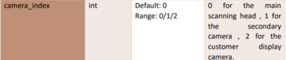

# Scanning Service Usage

This documentation is crafted to aid Android application developers for the Smart POS. It clarifies the functionality of the scanning service and provides details on the released SDKs, testing applications, and features for quickly launching the scan application. For specific downloads and further information, refer to the provided links and sections.

### Overview

The scanning service enables Android devices equipped with imaging hardware, such as cameras, to scan barcodes or QR codes, retrieving encoded data. This encoded information typically includes a web address, geographic coordinates, small text excerpts, and commercial product codes.&#x20;

### Document

| Version | Download                                                                                                                                                                        | Release Time |
| ------- | ------------------------------------------------------------------------------------------------------------------------------------------------------------------------------- | ------------ |
| 3.9.6   | [CloudposScannerUsage\_3.9.](https://ftp.wizarpos.com/barcodescan/CloudposScannerUsage_3.9.6_en.pdf)[6](https://ftp.wizarpos.com/barcodescan/CloudposScannerUsage_3.9.6_en.pdf) | 2024-04-11   |

#### Demos

| Version | Download                                                                                            | Release Time |
| ------- | --------------------------------------------------------------------------------------------------- | ------------ |
| 3.9.5   | [CloudposScannerDemo](https://github.com/SmartPOSSamples/CloudposScannerDemo.git)                   | 2024-02-02   |
| 3.9.5   | [CloudposScannerFloatModeDemo](https://github.com/SmartPOSSamples/CloudposScannerFloatModeDemo.git) | 2024-02-02   |
| 3.9.5   | [ScanWithButtonDemo](https://github.com/SmartPOSSamples/ScanWithButtonDemo)                         | 2024-04-28   |

Please get the lastest [SDK AAR](cloudpos-sdk-aar.md)

### Scan Barcode Testing Application

[Testing APK Download](https://ftp.wizarpos.com/techsupport/ticket/CloudposScannerDemoapp-release.apk)

This is a test demo built upon the CloudposScannerDemo mentioned above. During operation, please follow these steps:

1. Click the "Open" button to begin.
2. For Synchronous Scan, test using camera index 0.
3. For Asynchronous Scan, test using camera index 1.
4. For Non-full screen mode, test using camera index 2.
5. Once testing is complete, click the "Close" button to finish.

<div align="left"><figure><figcaption></figcaption></figure></div>


### Quickly Launch the Scan Application in Q2/Q3

Physical Action: Double-click the power button or long press Volumn+.

This feature enables the swift launch of the scan application. Upon clicking, the system searches for all installed applications and launches the one with the scan intent-filter. If multiple applications exist, the system presents a list for users to choose from, initiating the selected application. The code for the scan intent-filter is as follows:

```java
<action android:name="android.intent.action.SCAN" />
<category android:name="android.intent.category.DEFAULT" />
```

If no application in the system defines the scan intent-filter, pressing will not work. For instance, to use the scan button effectively, the application must define the scan intent-filter in its Android manifest file, with the category and action defined as follows:

```java
<activity
  android:name="com.XX.activity.MainActivity"
  android:label="@string/app_name" >
   <intent-filter>      
     <action android:name="android.intent.action.SCAN" />
     <category android:name="android.intent.category.DEFAULT" />
   </intent-filter>
</activity>
```

### CloudPOS Scan Service in Q1 Android 4.4

[CloudposScannerService-v3.12.28](https://ftp.wizarpos.com/advanceSDK/CloudposScannerService-v3.12.28-r35144-q1_releasekey_forQ1android4.4.apk)

### FAQ

* How to not show the scan window?     &#x20;

&#x20;     Set window\_width=0 and window\_height=0 in ScanParameter.

&#x20;     Generally, physical scanner don't need show the scanner window.

*
