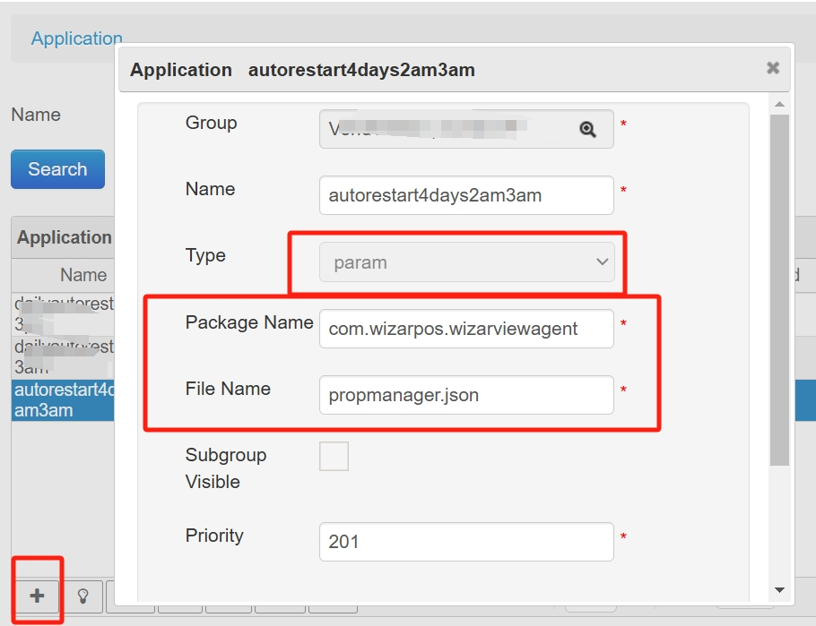

# Scheduled Terminal Reboot Setup

### **TMS Configuration (Supports Interval Days and Time)**

1. **Create a Parameter**:

Click **Applications > Application**, then click the **Add** icon button.

<figure><figcaption></figcaption></figure>

* Package Name: com.wizarpos.wizarviewagent
* Reference parameter file: [propmanager.json](http://ftp.wizarpos.com/advanceSDK/propmanager.json)
* Key-value pairs explanation:
  * `persist.wp.tms.reboot.time=2,3`: Indicates a random restart between 2 AM and 3 AM, retrying every 10 minutes until 3 AM. Default value is `2,5`.
  * `persist.wp.tms.reboot.days=4`: Indicates a restart every 4 days. If not specified, the default is 4 days, with a maximum of 30 days.
  * `persist.wp.tms.reboot.chkidle=true`: Checks if the current screen has been idle for more than half an hour. Default is `true` if not specified.

2. **Apply the Parameter to Terminal or Terminal Group**:

* Use TMS to apply the configuration to the target terminal or terminal group.

### **Notes**:

* When the restart time is reached, the Agent checks if the terminal screen is on. If the screen is on and in use, the restart will not be executed.
* If the screen is on but there are no click events for half an hour, the restart will still be executed even if the screen is on.

### **SDK Interface (Daily Reboot )**

#### Set reboot time

1.


```java
boolean setSelfRebootTime(int hour,
                          int minute,
                          int second)
```


Sets the self-reboot time of the terminal.

| Parameters |                       |
| ---------- | --------------------- |
| hour       | Restart hour (0-23)   |
| minute     | Restart minute (0-59) |
| second     | Restart second (0-59) |

#### Snippet Code Flow

```java
TerminalSpec terminalSpec = POSTerminal.getInstance(this).getTerminalSpec();
boolean result = terminalSpec.setSelfRebootTime(hour, minute, second);

```

2.

    <pre class="language-java" data-overflow="wrap"><code class="lang-java">boolean setRebootTimeByEveryDay(int hour,
                                    int minute,
                                    int second)
                             throws DeviceException
    </code></pre>

Sets the self-reboot time of the terminal.

| Parameters |                       |
| ---------- | --------------------- |
| hour       | Restart hour (0-23)   |
| minute     | Restart minute (0-59) |
| second     | Restart second (0-59) |

#### Snippet Code Flow

```java
ISystemDevice systemDevice = POSTerminalAdvance.getInstance().getSystemDevice();
systemDevice.open(this.mContext);
systemDevice.setRebootTimeByEveryDay(8, 10, 0);
systemDevice.close();
```


### **SDK Interface (**&#x52;eboot Immediately **)**<br>

#### Reboot


```java
boolean reboot()
        throws DeviceException
```


Reboot terminal.

| Returns |                                  |
| ------- | -------------------------------- |
| boolean | true: reboot, false: not reboot. |


**API Reference**: [WizarPOS SDK API Documentation](https://sdkwiki.wizarpos.com/wizarposapi/)
