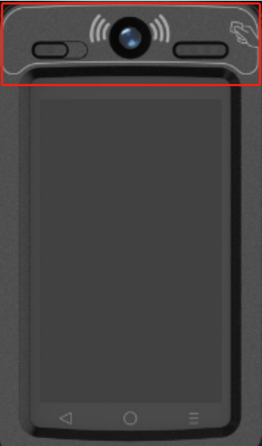

# Optimal Tap Positioning Guide

### Overview

This section provides guidelines on the best position for tapping a card on Q3-series terminals, specifically models like Q3F, which feature front contactless readers

<figure><figcaption></figcaption></figure>

### App Design Considerations

Developer's Role:

* In applications designed for these terminals, developers should include prompts or guides indicating the optimal card tap position.
* This guidance is crucial to ensure users are aware of the area with the strongest antenna signal for reliable card reading

<figure><figcaption></figcaption></figure>

### Guidance for Optimal Tap Position

* The exact position for optimal card tapping should align with the area of highest antenna intensity in the terminal.
* Details on this position may vary based on the specific terminal model and should be confirmed with the hardware specifications.

### Important Notes

* Ensuring users tap their card at the correct spot is essential for efficient and error-free transactions.
* Developers should prioritize this feature in their app designs for enhanced user experience and transaction success rates.
