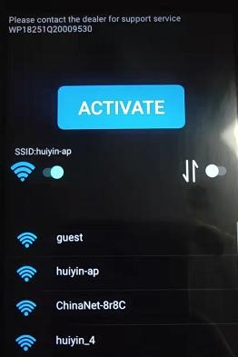
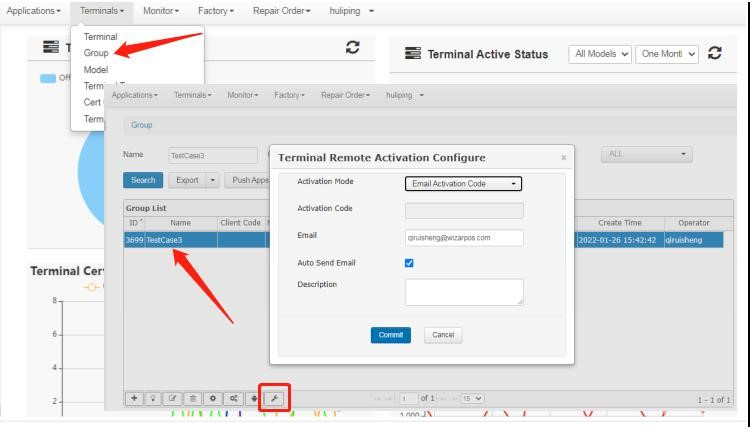
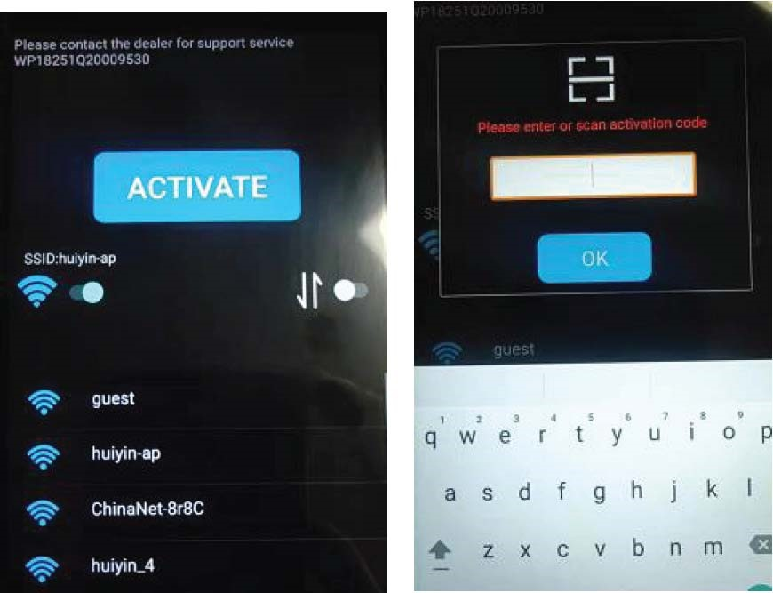
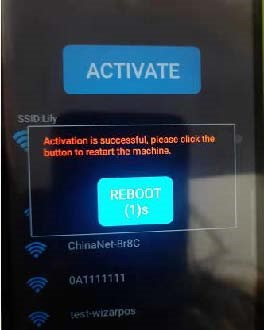

# Remotely Reactivate from Tamper

### Understanding the Tampered Screen

*

    
<figure><figcaption></figcaption></figure>

### Configuring Activation Rules in TMS

**Step-by-Step Guide:**

1. **Log into TMS:** Access your Terminal Management System (TMS) account.
2. **Setting Up Activation Mode:**
   * Navigate to **'Terminals > Group**' and select your desired group.
   * Click on **'Terminal Remote Activation Configure**'. This will open a configuration page.

<figure><figcaption></figcaption></figure>

**Activation Modes:**

* **Disable:** Remote activation is not possible. Only local TF card activation is allowed.
* **Automatic Activation:** Terminals activate immediately upon clicking the **'ACTIVATE**' button, without requiring an activation code. This method is convenient but less secure.
* **Activation Code:** Set a 6-16 character activation code. Regular updates to the code are advised for enhanced security.
* **Email Activation Code:** Enter an email to receive a one-time, non-reusable activation code. This is the most secure method.
* After choosing the mode, click the **'Commit**' button to finalize settings.

### POS Activation Operation

* Ensure the terminal is connected to the Internet.
*   ### Click the **'ACTIVATE**' button on the terminal.

    * **Automatic Activation:** The terminal activates immediately.
    * **Activation Code/Email Activation Code:** Enter the activation code set in TMS or received via email.
*

    
<figure><figcaption></figcaption></figure>

* After successful activation, a **'REBOOT**' button appears.
* Click **'REBOOT**' to restart the terminal, allowing it to enter the system.

<figure><figcaption></figcaption></figure>

