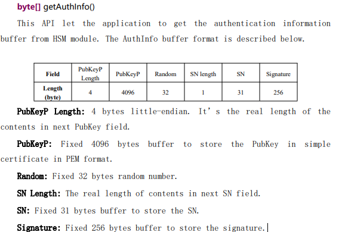

# Understand Remote Key Injection

## Remote Key Injection (RKI) Development Guide

### Scenario 1: Integrating with an Existing Host Server

To integrate Remote Key Injection (RKI) capabilities into an established host server, developers must implement a customized terminal-side Agent and adhere to strict certificate security requirements to establish a proper chain of trust.

#### **1. Core Responsibilities of the Agent**

The Agent acts as a critical bridge between the host server and the terminal's secure environment, bearing the following responsibilities:

* Server Interaction: Communicates securely with the host server to request and retrieve the encrypted injection keys.
* Key Injection: Invokes the terminal's local AIDL interfaces to safely provision and inject the retrieved keys into the underlying hardware security module (HSM).

#### **2. Certificate Requirements & Initialization**

Because remote key injection involves high-level security validation, a mutual authentication mechanism must be established between the terminal and the server:

* Terminal-Side Verification: During the key injection process, the terminal _must_ verify the legitimacy of the incoming key certificate. This ensures the authenticity and integrity of the key source and prevents unauthorized or malicious keys from being written.
* Server-Side Verification: Certain host servers also require validation of the terminal's device certificate before distributing keys, confirming that the requesting terminal is authentic and authorized.
* Certificate Initialization: Given these mutual authentication demands, the terminal certificate initialization process is indispensable in Scenario 1. Before executing the RKI workflow, developers must ensure that the terminal has successfully triggered and completed its certificate initialization so that it possesses valid identity credentials.

#### **3. AIDL Interfaces**

WizarPOS provides two core terminal AIDL (Android Interface Definition Language) interfaces for the Agent to invoke during the key injection workflow. See the [cloudPOS\_remote\_key\_injection\_demo\_system manual](https://ftp.wizarpos.com/advanceSDK/wizarPOS_remote_key_injection_demo_system_20241217.pdf) for details.

```java
    byte[] getAuthInfo();    
    int importKeyInfo(byte[] keyInfo);   
```

<div align="left"><figure><figcaption></figcaption></figure></div>

<div align="left"><figure><figcaption></figcaption></figure></div>

### Scenario 2: Systems Without an Existing Host Server

Developing a fully custom Remote Key Injection system from scratch is highly time-consuming and typically lacks the mandatory PCI compliance certification. Therefore, building a proprietary server is recommended only for internal testing or evaluation.

To accelerate your development and testing phase, WizarPOS provides a comprehensive RKI Demo System for your reference, which includes the following core components:

* [cloudPOS\_remote\_key\_injection\_demo\_system manual](https://ftp.wizarpos.com/advanceSDK/wizarPOS_remote_key_injection_demo_system_20241217.pdf): A comprehensive reference manual that covers the entire demo architecture, certificate management mechanisms, and core cryptographic workflows.
* [Terminal APP](https://github.com/SmartPOSSamples/InjectKeyDemo.git) : Provides the complete reference source code for the terminal-side client.
* [Server Project](https://github.com/SmartPOSSamples/RemoteKeyInjectServer.git)Provides the complete reference source code for the backend server.
  * Includes `Remote_Key_Inject_Deployment.docx`: This deployment document is bundled within the server project package, providing step-by-step guidance on how to configure the server environment, deploy, and run the key-injection JAR application.

**🔐 Certificate Management for Testing**

The demo environment relies on a dedicated test certificate that overrides the terminal's default factory certificate:

1. Certificate Initialization: Download and execute the [Certificate Initialization APK](https://ftp.wizarpos.com/advanceSDK/init_democert_20260129.apk) on the terminal to generate and provision the demo certificate.
2. Environment Clean-up: Ensure the demo certificate is completely cleared from the terminal after testing to restore the standard secure terminal environment. Here is the c[learnup the demo certificate](http://sdkwiki.wizarpos.com/index.php?title=How_to_Clear_Terminal_Certificates) APK.

> ⚠️ Production Security Warning: While WizarPOS delivers a comprehensive RKI framework, the provided demo system is strictly for sandbox testing and reference. Prior to live environment deployment, you must replace all demo certificates with valid, secure, and CA-certified production credentials.

