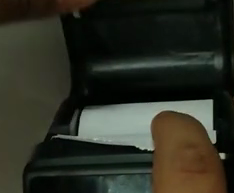

# Verify Terminal Printer Status

### Initial Steps:

1\. **Paper Roll Compliance:** Ensure the paper roll adheres to the specified standards.

* **Paper Width:** Must be 57.5 ± 0.5 mm.
* **Outer Diameter Specifications:**
  * For Q1 Model: 30 mm.
  * For POS1V2 Model: 40 mm.
  * For Q2 Model: 40 mm.
  * For Q1V2 Model: 30 mm.

2\. **Proper Insertion of Roll**: Confirm that the paper roll is correctly inserted into the printer. Reference the provided image illustrating paper insertion for the Q2 printer model.

<figure><figcaption></figcaption></figure>

### Testing Procedure Using Merchant Self-Test Software:

1. Navigate to the 'Settings' menu on the terminal.
2. Select 'About POS' > 'POS Configuration'.
3. Choose 'Merchant Self Test'.
4. Select 'Printer' to initiate the test.
5. After successful completion, a test receipt should print.

### Troubleshooting:

* If the printer does not function as expected, compile a system log.
* Contact a technical engineer for further assistance, providing the prepared log for detailed analysis.


**Note:** Adhering to these steps ensures proper functioning and troubleshooting of the printer in Smart POS terminals. The process may slightly vary based on specific terminal models. For detailed instructions tailored to your model, refer to the user manual or contact customer support.

