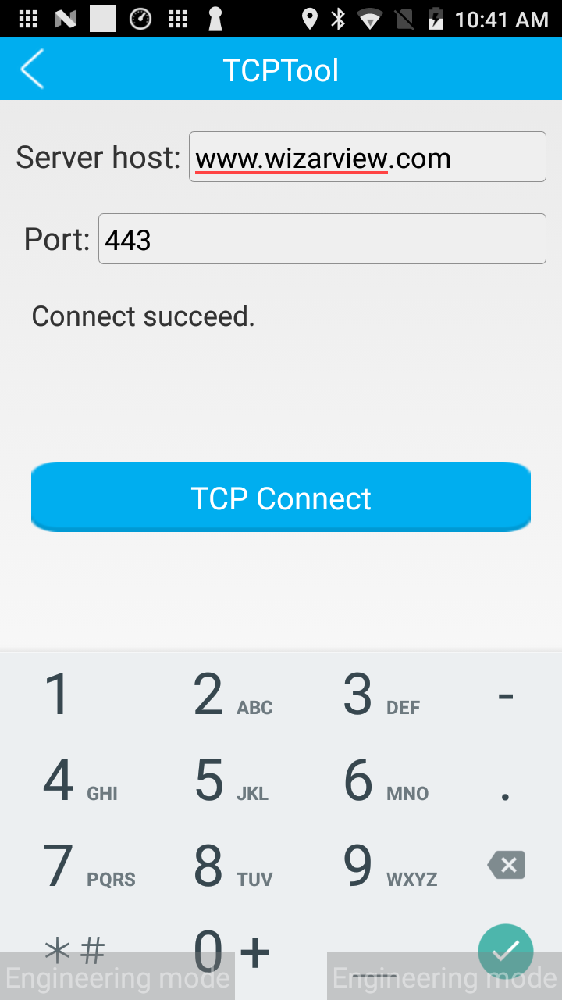

# Understand Merchant Self Test

### Accessing the Merchant Self-Test Menu

* Navigate to: Settings > About POS > POS Configuration > Merchant Self Test.
* Or click Settings button in home,  then click Self-Check.

### Testing Components

* Camera Tests
  * Prime Camera: Test the primary camera (Camera 0).
  * Zoom Camera: Test the secondary zoom camera (Camera 1).
* RF Card Reader Test
  * Test the contactless card reader by swiping a contactless card.
  * For CPU RF card tests, use the following APDU command: 'byte\[] arryAPDU = new byte\[]{(byte) 0x00, (byte) 0xA4, (byte) 0x04, (byte) 0x00,(byte) 0x0E, (byte) 0x32, (byte) 0x50, (byte) 0x41,(byte) 0x59, (byte) 0x2E, (byte) 0x53, (byte) 0x59,(byte) 0x53, (byte) 0x2E, (byte) 0x44, (byte) 0x44,(byte) 0x46, (byte) 0x30, (byte) 0x31}'.
* Smart Card Reader Test
  * Insert a smart card to test connection and disconnection functionality.
* MSR (Magnetic Stripe Reader) Test
  * Swipe a magnetic stripe card to display track data for all three tracks.
* Printer Test
  * Conduct a simple receipt print test.
* Network Tests
  * WiFi Network: Test WiFi connectivity by accessing the following URLs: https://www.microsoft.com/, https://www.google.com/, https://www.wizarpos.com/, https://www.wizarview.com/
  * Mobile Network: Ensure WiFi is disabled before testing. Connect to the same URLs as in the WiFi test.
* Touch Screen Test
  * Conduct a functionality test of the touch screen.
*   Advanced Options

    * Submit Logcat: Send system logs to the TMS server.
    * Check Small Battery: Follow on-screen instructions to check battery status.
    * PingTool: Use this tool to ping any specified address.

    &#x20;      .png>)

    * PSAM Card: Test the PSAM card by powering it on and sending an APDU command: 'new byte\[]{0x00, (byte) 0x84, 0x00, 0x00, 0x08}'.
    * TCPTool: Use this tool to establish a TCP connection to any specified address
    * Button: Test the functionality of the keyboard.
    * Key Verify: Verify the integrity of the terminal's private-public key pair and owner certificate.
    * Show touches: Toggle the display of touch screen interactions with a white dot.
    * PINGUI: Test the functionality of the PINPAD GUI.
