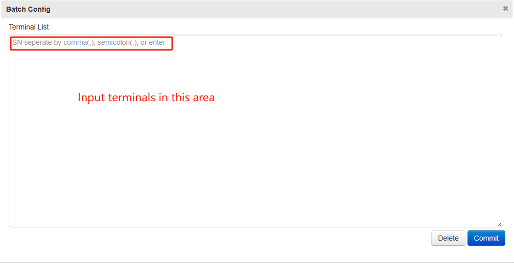

# Push Apps Using Tags

### Overview

Wizarview manages terminals in groups, making it easy to configure the same apps for all terminals within a single group. However, to configure apps for terminals across different groups, the use of Tags is essential. Tags offer an additional dimension for managing terminal apps for varied purposes, allowing for cross-group configurations.

### Steps to Push Apps Using Tags

#### Create Tag

Click Terminal>Terminal Tag, it will display the Tag list, click icon button Add

<figure><figcaption></figcaption></figure>

, then create new tag for different requirements, for example we can create 3 tags, gym, catering, loyalty:

.png>).png>).png>)

Configure Tag

Click icon button Config

<figure><figcaption></figcaption></figure>

, it will display Tag Configure window.

<figure><figcaption></figcaption></figure>

In the bottom Terminal List, choose terminals, perhaps the terminals are in different groups, for example terminals in East City group, North City group, click Configure button in the bottom, then they can configure the same tag.

Click Config Application tab, then configure Apps for the tag

<figure><figcaption></figcaption></figure>

In the bottom Application List, choose application, then click Configure button, you can configure many apps for the tag. After above two steps, the tag has configured successfully.

If you want batch configure terminals, you can click Batch Config Terminal tab, input SNs as requirement. Here is the batch config page:

<figure><figcaption></figcaption></figure>

#### Push Tag

Choose the tag in Tag list, click Push Apps, it will push immediately.

#### Monitor the Tag download status

Choose Monitor>Download log, if will display the terminals which downloaded applications configured in the tag. And if you want to search one application, you should input the application name in Application input area, click Search button, if will display which terminals downloaded the application

<figure><figcaption></figcaption></figure>

### Considerations

* Cross-Group Management: Utilizing tags effectively allows for more flexible and targeted app deployment across various groups.
* Tag Consistency: Ensure tags are consistently applied across the terminals for accurate app deployment.
* This method is particularly useful when you need to target a specific subset of terminals that do not fall under a single group but share common characteristics or requirements denoted by the tags.
