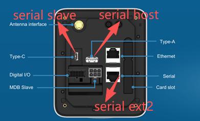

# UPT

### [Resources in Wiki](https://sdkwiki.wizarpos.com/index.php?title=Payment_App)

* Please choose the appropriate integration method based on your specific needs.

### Hardware

* [UPT terminals](https://ftp.wizarpos.com/techsupport/ticket/wizarpos_briefinfo.pdf)
* [Serial Ports](https://ftp.wizarpos.com/techsupport/ticket/serialpicture.png)

<figure><figcaption></figcaption></figure>

*

### PAYwizard

* [Payment process flowchart for open-door cabinets](https://ftp.wizarpos.com/techsupport/ticket/opendoorpic.png)
* The default timeout for PAYwizard is 3 minutes. How can I set it to never time out?

&#x20;     Set paymentTimeout=0.

* How do I change the logo at the bottom?

&#x20;     Set LogoUrl to the customized logo URL.

* ProtocolType defination in PAYwizard

&#x20;     DEFAULT: For calling AIDL API of PAYwizard&#x20;
\
&#x20;     CLOUD MODE: use paywizard payment
\
&#x20;     SERIAL SLAVE: use usb cable
\
&#x20;     SERAL HOST: use UUcable
\
&#x20;     MDB: use MDB
\
&#x20;     SERIAL EXT: use physical serial port
\
&#x20;     SERIAL EXT2: user RJ45 serial port
\
&#x20;     PULSE MODE: use pulse
\
&#x20;     SOCKET SERVER: use network

* Why to set debug mode?

&#x20;     Only in debug Mode, can set payment app package name to the payment demo apk, other mode can not.&#x20;

* The default duration for debug mode is 5 days, which can be configured through parameter(keepDebugModeTime).
* Enable exit directly: after set it, click Back button, will popup an Exit dialog, click Confirm button to exit it.
* In PAYwizard running page, long press the SN showed on the left-up corner, will popup a dialog, display the IP and the current Protocal Type.
* The vending machine initiated the transaction, but it did not jump to the payment page. It is necessary to check if the payment package name has been configured correctly in PAYwizard.
* If the amount displayed in payment page is incorrect, please check the "currencycode" setting. If it is in MDB mode, please also check the "scaling factor" and "decimal places" settings.
* Can I use two protocal modes? For example, use Default mode to do purchase, use cloud mode to do settlement?&#x20;

&#x20;     No, you cann't, each mode will process through by PAYwizard, in PAYwizard, can only set one mode.

* In cloud mode, what's the meaning of the "Unbound payment terminal"?

&#x20;     This is caused by the app hasn't bound the vending machine to the payment terminal yet.

* When complete a pre-authorization, because different payment channels require different original transaction information, you can pass all the original transaction information defined in the protocol. Alternatively, you can add a check in your application and pass the original transaction information returned from the pre-authorization.
* "connect payment app failed", when this error occured, please verify whether install payment app, then verify whether payment package name has set in PAYwizard. &#x20;
* PAYwizard call payment app, the default time out is 180s(3min), it can configure by paymentTimeout parameter.
* CurrencyCode should transfer in each transaction.
* How to obtain the serial number (SN) via PAYwizard?

&#x20;     When making the protocol request, the value "SN" is passed in the AdditionalInfo field ("AdditionalInfo":"SN"). PAYwizard will then return the device's serial number (SN) in the AdditionalInfo field of the response.

&#x20;     If develop app in terminal, please get SN by using android.os.Build.SERIAL

* In the payment demo environment, using a bank card will not result in actual charges.
* How to disable the user confirmation when payment?

&#x20;     Use the SkipConfirmProcedure parameter. It doesn’t wait for user confirmation and just proceeds automatically

*

### Payment

* What parameters should be passed when canceling a pre-authorization? Is it TransIndexCode?

&#x20;     No, TransIndexCode is unique for each transaction, and its uniqueness is guaranteed by the third-party application itself, including transactions such as consumption, reversal, pre-authorization, pre-authorization incremention, and pre-authorization completion. For transactions requiring reversal, increment, or completion, the original transaction's TransIndexCode should be sent as OriTransIndexCode. Other original transaction data should be sent as Ori data: TraceNum->OriTraceNum, TransID->OriTransId, InvoiceNum->OriInvoiceNum, RRN->OriRrn.

* How long does it take from the pre-authorization amount being authorized to the actual deduction?

&#x20;     Generally, it's real-time. Pre-authorization is a freeze, and pre-authorization completion is an unfreeze, which can be understood as a consumption transaction with real-time deduction. Pre-authorization and pre-authorization completion may not happen simultaneously. For example, when staying at a hotel, a pre-authorization of 500 yuan is made today, and tomorrow when leaving the hotel, the pre-authorization is completed for 400 yuan. The money is deducted when the pre-authorization is completed.

* Canceling a pre-authorization:

&#x20;     TransType is Reversal

* After sending a pre-authorization request message, if the user does not swipe the card after a certain period, it will return "cancel". If the card is swiped, a response will be received immediately.
* Refund requires card swiping. However, in some versions of the refund process: if the order is already completed when sending the refund request, no card swiping is needed, and it will succeed immediately. If the order does not exist, it will wait for 1 minute and then return a timeout.
* Reversal and pre-authorization completion do not require card swiping.
* If a user spends two yuan, and we realize we made a mistake and need to refund 1 yuan

&#x20;     This scenario can be achieved by pre-authorizing 2 yuan and completing the pre-authorization for 1 yuan, or by consuming 2 yuan and reversing 1 yuan of the consumption.

* Can Reversal only reverse pre-authorizations that have already been swiped, because there is a TransID in this case?\
  If the user has not swiped the card, how should this pre-authorization be canceled?

&#x20;     You can use the protocol data CTRL: 0xC1 to indicate a Cancel Request.

* After pre-authorization completion, no further additions can be made; it's equivalent to a completed deduction. Therefore, it's necessary to perform pre-authorization increment before the pre-authorization is completed; if you want to increase the deduction after completion, you must send a new pre-authorization and must swipe the card again, then pre-authorization completion; or send a card consumption transaction. Pre-authorization increment can be sent multiple times, but completion can only be sent once.
* Settlement: Is it performed once a day at a specified time?

&#x20;     Yes.

* When testing settlement, do we not need to send the amount? Should all unsettled transactions be automatically settled?

&#x20;     Yes, you don't need to send the amount.

* Currency and minimum unit reference: [https://en.wikipedia.org/wiki/ISO\_4217](https://en.wikipedia.org/wiki/ISO_4217)
* The `transAmount` is always passed as an integer string. The actual amount depends on the minimum unit specified above. For example, if the unit is 2, then the amount will have two decimal places.
* Can `refund` be called multiple times? For example, if 10 yuan was deducted, can it be refunded in three installments of 2, 6, and 2?

&#x20;     This is allowed for offline payments, but it depends on the specific payment channel. Most channels support this type of refund.

* Generally, when we talk about scanning codes, we're looking at it from the user's perspective. When a user scans a POS terminal, it's a user-initiated scan; conversely, being scanned means the user's device is being scanned.
  \
  2c2p uses user-initiated scanning.
  \
  QR code payment involves scanning the QR code on the mobile phone; it won't be displayed on the POS machine. The payment demo doesn't support user-initiated scanning because this demo is offline and doesn't have a backend to query payment results.
  \
  Mpay currently only supports being scanned (passive scanning, where the merchant actively scans the payment code displayed on the consumer's mobile phone).
* Are there any extra fees for refunds? Do you support partial refunds? What is the refund processing time?

&#x20;     Are there any extra fees for refunds? Do they support partial refunds? The refund processing time depends on the payment method and channel. Generally, there are no extra fees, and most methods support partial refunds. Refund times vary, ranging from instant processing to taking a day or up to 7 days, depending on the payment channel.

* What is the maximum amount for a pre-authorization? How can a pre-authorization be canceled?

&#x20;     There is generally no upper limit set for the pre-authorization amount, but it usually does not exceed the maximum amount for a single transaction at the terminal (default is 999999.99). The pre-authorized amount can be released through a pre-authorization cancellation. If using PAYwizard, this would involve calling the Reversal transaction.

* Does a single POS terminal have a threshold for transactions awaiting settlement? If so, what is the threshold?

&#x20;     The settings for each channel are different, but generally the default is 500 transactions.

* If a payment deduction or refund fails, is it possible to return the specific reason through the API?

&#x20;     Generally, a return code and return message will be returned.

* Can a single pre-authorization be followed by multiple pre-authorization increment or pre-authorization completions (for example, due to insufficient funds or network issues causing transaction failure)?

&#x20;     This is also related to the payment channel; generally, one pre-authorization supports multiple subsequent transactions and is completed in a single process.

* When settlement, will the uncompleted pre-authorization transactions be automatically captured?

&#x20;     No

* if Purchased Amount > Pre-Auth Amount, then there will be a need to trigger a new sales transaction charge for remaining charge. Customer will need to tap the card again.
* Once the pre-authorization is complete, no further amounts can be added. It's equivalent to a completed deduction. Therefore, any additions to the pre-authorized amount must be made before the pre-authorization is finalized. If you want to increase the deduction after completion, you will need to issue a new pre-authorization and complete the process again, requiring a card swipe; or you can process a separate card payment transaction.
* In production environments, unattended vending machines generally do not support initiating void / reversel/ refund transactions manually on the machine.\
  Transactions such as void-sale, auth-cancel, refund, and reversal on vending machines are usually only initiated directly by the vending machine itself. The vending machine initiates the reversal and passes the primary key of the original transaction (sale / pre-auth / pre-auth completion), such as OriTransactionsID, oriInvoice, or oriTrace. A typical use case is:\
  Customer selects a product → payment succeeds → dispensing fails (out of stock / vending machine issue) → the vending machine initiates a reversal. Next is about the definition of the AIDL Reversal transaction type.\
  Currently, OPC unifies the reverse transactions as follows:\
  the reverse transaction of sale → void\
  the reverse transaction of pre-auth → auth-cancel\
  the reverse transaction of pre-auth completion → completion reversal\
  These three reverse transaction types are all invoked through the same AIDL method: Reversal.\
  Because these reverse transactions must all be completed on the same day and within the same batch, the payment application contains the original transaction information for these reverse transactions.\
  For example, when AIDL calls reversal and passes oriTransactionID, the payment application needs to locate the original transaction using this TransactionsID.\
  If the original transaction is sale, it will automatically perform a void.\
  If the original transaction is pre-auth, it will automatically perform an auth-cancel, and so on. Finally, regarding the refund transaction: generally, it is not recommended for payment applications in unattended scenarios to support refunds. This is because some card schemes’ L3 certification requires that a refund must be performed with the card present and must continue processing even after receiving an AAC, which does not fit the unattended scenario.\
  Some acquirers have looser restrictions and may approve a refund transaction by submitting the card information from the original transaction. However, this approach is not compliant and carries certain risks.
