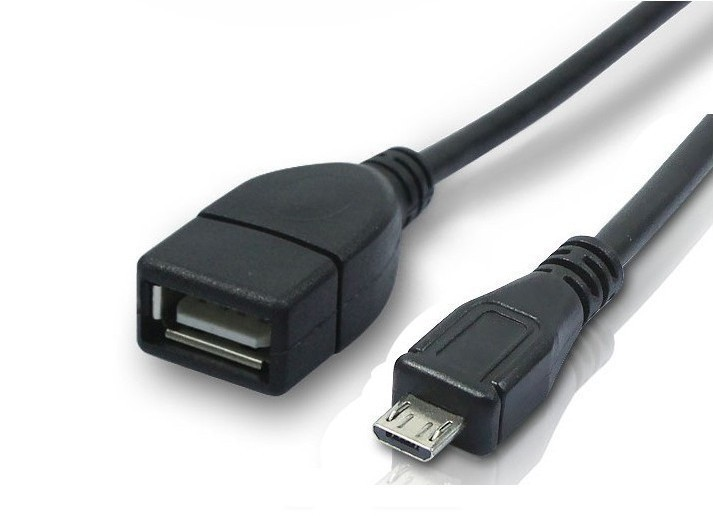
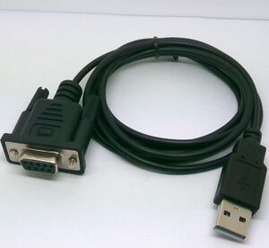
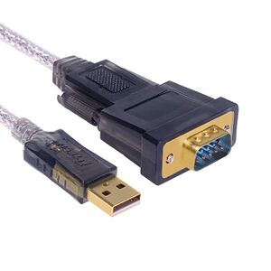
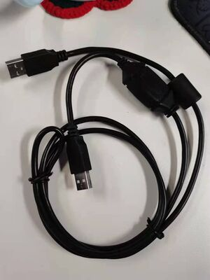

# Serial Port Development

### Introduction:

This guide provides a demonstration on how to develop an application that utilizes serial ports, using both Java and C APIs. Included are sources for a serial port test tool and downloadable demo applications.

### Demo and Tool Downloads:

1. Serial Port Test Tool:
   * Download the [Source APP](https://github.com/SmartPOSSamples/SerialportTestTool.git) and [APK](https://ftp.wizarpos.com/advanceSDK/SerialPortTestTool3.1.apk) for a serial port testing tool.

### Best Practices for Reading Data from a Serial Port:

* **Known Data Length:**
  * If the length of the data (`len`) is known, set the receive buffer to this length (`len`).
  * Set the timeout to forever. The SDK will return once it has received the specified length of data.
* **Unknown Data Length:**
  * Set the receive buffer to 1 byte and the timeout to forever.
  * When data is received, continue reading in a loop.
  * Set the buffer to 256 bytes (or another length) and the timeout to 200ms to receive all data.
* **Good Practice - Define a Data Packet Protocol:**
  * Define a packet header (e.g., 3 bytes) that includes the data length.
  * Set the receive buffer to 3 bytes and the timeout to forever.
  * After receiving the header, set the buffer to the parsed data length (`len`) and the timeout to forever to receive all data.

### API Usage:

1. Java API for Serial Port:
   * When opening a serial port using the Java API, set the logic ID of the serial port as a parameter.
     * SerialPortDevice.ID\_USB\_SLAVE\_SERIAL : works for USB serial port in slave mode.
     * SerialPortDevice.ID\_USB\_HOST\_SERIAL : works for USB serial port in master mode.
     * SerialPortDevice.ID\_SERIAL\_EXT : works for internal fiscal/ other serial port module.
     * SerialPortDevice.ID\_USB\_CDC: works for USB Communication Device Class.
     * SerialPortDevice.ID\_USB\_GPRINTER: works for USB GPRINTER.
     * SerialPortDevice.ID\_USB\_SLAVE\_SERIAL\_ACM: works for ACM without Qualcomm driver.
     * SerialPortDevice.ID\_SERIAL\_VENDOR(Deprecated): works for RJ45 serial port.
     * SerialPortDevice.ID\_SERIAL\_EXT2: works for RJ45 serial port.
2.  When need to open multiple serial ports in an application, please use the method to obtain the serial port instance.

    <pre class="language-java" data-overflow="wrap"><code class="lang-java">POSTerminal.getInstance(context).getDevice(POSTerminal.DEVICE_NAME_SERIALPORT, serial logic ID);
    </code></pre>
3. C API for Serial Port:
   * When using the C API to open a serial port, the device name of the serial port must be specified as a parameter.

Device Name:

<table><thead><tr><th width="149">Parameters</th><th></th></tr></thead><tbody><tr><td>device name</td><td>
The alias for serial port. Available values: DB9, GS0_01, WIZARHANDQ1, Q1_USB_SERIAL, USB_SERIAL, SERIAL_EXT, USB_SLAVE_SERIAL, USB_HOST_SERIAL
<ul><li>
in W1/W1V2:
<ul><li>DB9: works for DB9 port at the back side of the terminal.</li><li>GS0_Q1: works for USB host port at the right side of terminal to connect with Q1 via USB cable in master mode.</li></ul></li><li>
in Q1 3g:
<ul><li>WIZARHANDQ1: works for USB serial port in slave mode.</li><li>Q1_USB_SERIAL or USB_SERIAL: works for USB serial port in master mode.</li><li>SERIAL_EXT: works for internal fiscal/other serial port module.</li></ul></li><li>
in Q1 4g and Q2(K2, M2, M3, QD4/5), Q3 series and others:
<ul><li>USB_SLAVE_SERIAL: works for USB serial port in slave mode. For example, terminal use USB OTG cable connect the PC directly.</li><li>USB_HOST_SERIAL or USB_SERIAL: works for USB serial port in master mode. For example, terminal connect an USB2Serial convertor or use UU cable.</li><li>SERIAL_EXT: works for internal fiscal/other serial port module.</li><li>USB_CDC: works for USB Communication Device Class.</li></ul></li></ul></td></tr></tbody></table>

### Cable Connection Guidelines:

For Model Q4:

* Refer to Picture 2 and Picture 3 for connecting using a USB to DB9 cable.
* Alternatively, refer to Picture 4 for connection using a UU cable.
* Please ensure all connections and API parameters are correctly set for successful communication with the serial port.

Cable pictures:

<figure><figcaption>
picture 1(otg-usb cable)
</figcaption></figure>

<figure><figcaption>
picture 2(usb db9)
</figcaption></figure>

<figure><figcaption>
picture 3(usb db9)
</figcaption></figure>

<figure><figcaption>
picture 4(UU cable)
</figcaption></figure>
